## Partners

- Shashank vinoo CID:02600927
- Archit Bhansali CID:

## Features

This project implements a multithreaded UDP chat application with a simple command protocol. Each client binds to its own UDP port, runs **two threads** (one for user input, one for receiving server messages), and logs everything it receives to a per-client text file (`iChat_<port>.txt`).

#### Progress
We completed the assignment fully up to and including PE2. 

### Supported commands
The server parses incoming requests and handles the following commands:
- `conn$ <name>` — connect/register a client name
- `say$ <msg>` — broadcast a message to connected clients
- `sayto$ <recipient> <msg>` — send a private message to one client
- `mute$ <name>` — stop receiving broadcasts from a specific client
- `unmute$ <name>` — start receiving broadcasts from that client again
- `rename$ <new_name>` — change your displayed name
- `disconn$` — disconnect from the chat
- `history` — displays last messages before client connects

### Admin mode + `kick$`
An admin client can be started by running the client with the `admin` argument, which binds to the reserved UDP port **6666**. This admin client has the privilege to:
- `kick$ <name>` — remove a client from the chat

### Server architecture
- The server binds to the known UDP port **12000** and runs a dedicated listener thread that waits for incoming UDP packets.
- For each received packet, the server spawns a separate worker thread to process that request concurrently.
- Client state is stored in a shared linked list and protected using reader–writer locks to keep list operations thread-safe.
- Mute relationships are tracked so broadcast messages can be filtered per-recipient.

### UI / Logging
- Each client writes all received server output to `iChat_<port>.txt`, making it easy to monitor output in another terminal using:
  - `tail -f iChat_<port>.txt`

### Extras
- Added debug output to make testing easier.
- Helper functions added for parsing and request handling.
- Simple terminal UI using multiple per-client log files based on each client’s port.

### PE1 Implementation
To create a solution to PE1 we implemented a circular buffer which stores the latest 15 message sent on the chat. In order to make the chat logs more readable, we decided to separate user-specific server notifications like ping$ or kick$ acknowledgement and user messages from say$ and sayto$. General server notifications that apply to all clients like a new client joining or a client being kicked from the server still get reported in the chat logs.

### PE2 Implementation
To create a solution to PE2 we decided against using a min-heap. Instead we decided to add extra variables to the ClientList nodes to store the last timestamp of activity, a flag to indicate whether to expect a ping from the client and a deadline for the ret-ping$ to be received by the server. A new ping thread was created to cycle through the client list every 20 seconds and check each clients' latest activity, removing, notifying or skipping as needed. The min-heap data structure would be more efficient in time complexity in terms of a per update basis compared to the linked list sweep (O(LogN) vs O(N)), especially for a larger client base. 

## Basic Functions tested

### `conn$`

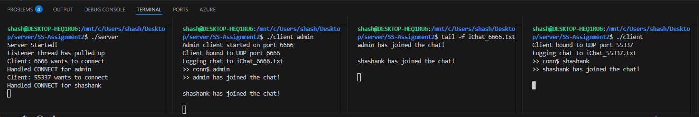

- Both clients are clearly on different UDP ports: the admin uses the fixed **6666**, and the normal client gets an auto-assigned free port.
- The server logs show it handled **CONNECT** for both users, so the server is tracking both clients correctly.
- Each client creates its own log file using the pattern `iChat_<port>.txt`, which is what we tail for the UI.

### `say$` 

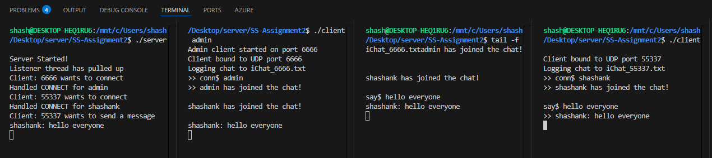

- `shashank` sends a broadcast message using `say$ hello everyone`.
- The server prints the message under the sender’s name, showing it was received and processed.
- Both log files update (admin + shashank), meaning the broadcast reached everyone (including the sender).

  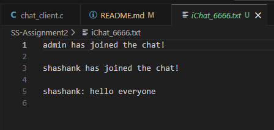
  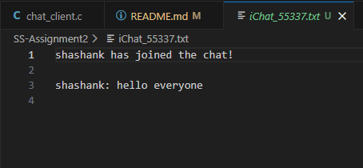

### `sayto$` 

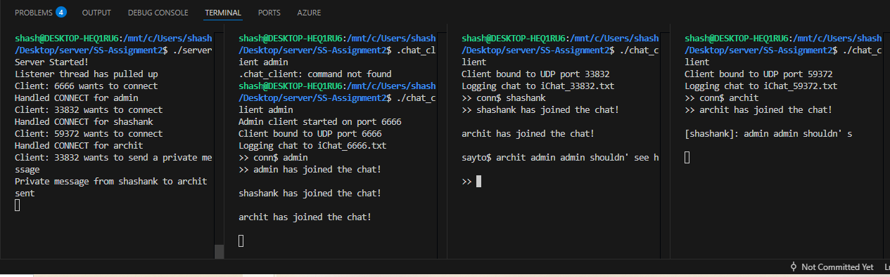

- `shashank` sends a private message to `archit` using `sayto$ archit <message>`.
- The server logs show it received a private message request and routed it to the correct recipient.
- Only the intended recipient’s log updates, other clients should not see the private message.

  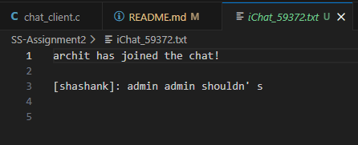
  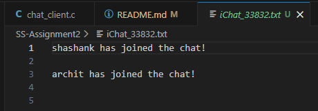
  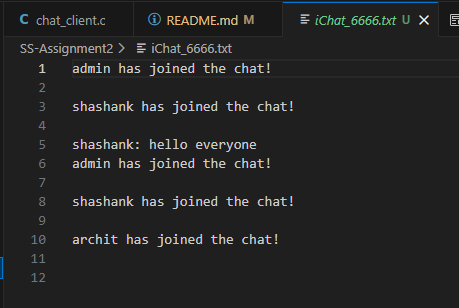

### `mute$` and `unmute$`

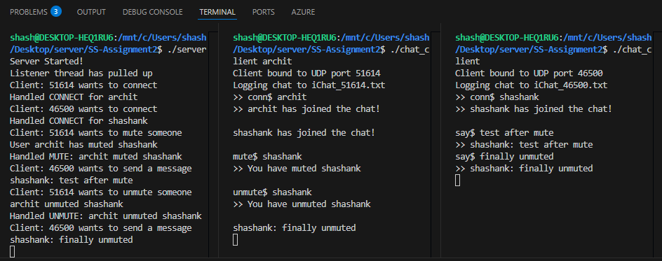

- `archit` mutes `shashank` using `mute$ shashank`, and the server acknowledges it.
- While muted, messages from `shashank` should stop appearing in **archit’s** log.
- After `unmute$ shashank`, `archit` starts receiving `shashank` again, proving the mute pairing is being applied correctly.

  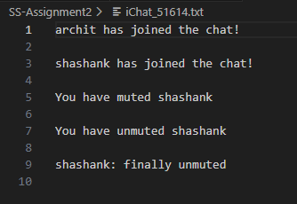
  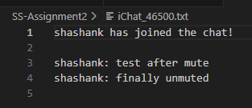

### `rename$`

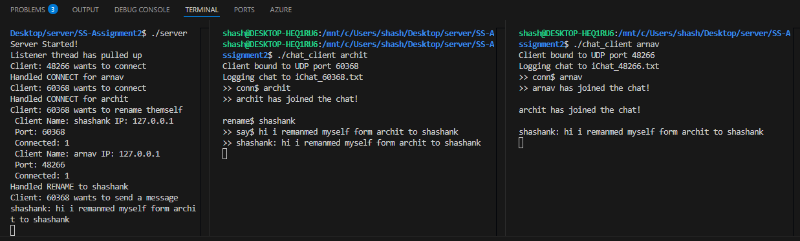

- The client renames themselves using `rename$ <new_name>`.
- After renaming, future messages appear under the new name (and the server output reflects the updated client record).

### `disconn$`

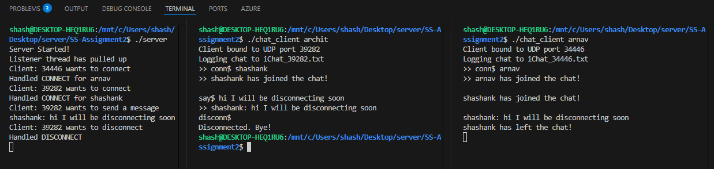

- The client sends `disconn$` to the server and then exits cleanly back to the terminal.
- The server logs show it handled the disconnect and broadcasts a “left the chat” message to the remaining clients.

### `kick$`

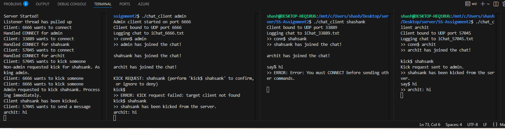

- Here we have **three clients** connected: `admin` (fixed port **6666**), `shashank`, and `archit`.
- When **archit** tries `kick$ shashank`, the server rejects it because archit is **not admin**, and the request gets forwarded to admin instead (“Kick request sent to admin”).
- The admin then types `kick$ shashank` to **confirm** the kick. The first attempt fails with `target client not found` (case/lookup mismatch), but the second confirmation succeeds.
- Once confirmed, the server kicks `shashank` immediately and broadcasts the result so other clients (like `archit`) see that `shashank` has been kicked.

### **History Extension (Last 15 Messages on Join)**

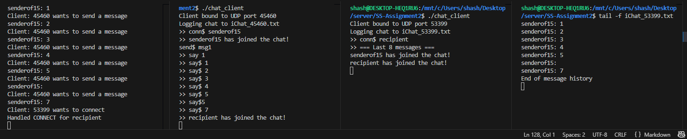

- In this test, we simulate a client (`senderof15`) sending a sequence of messages before anyone else joins the chat.  
  The server records each of these messages inside the **circular message buffer**, which stores up to the **last 15 messages**.

- After sending messages like:

    - say$ 1
    - say$ 2
    - …
    - say$ 7

a new client named **recipient** joins the chat.

- As soon as `recipient` connects, the server immediately sends them a formatted history block:

This matches the server’s internal log exactly the new client sees only the most recent messages, **not everything from the beginning**.

- On the UI side, using: tail -f iChat_53399.txt

you can verify that the history is correctly written into the recipient’s log file, showing the final circular buffer output.

- This test demonstrates that:
- The **circular buffer** correctly stores only the **most recent messages**.
- New clients always receive the **latest 15 messages** on connection.
- The UI logs and terminal output remain consistent across clients.
- Older messages outside the buffer window are **not sent**, exactly as required.

This confirms the history extension is fully working and consistent across server, client, and UI outputs.

